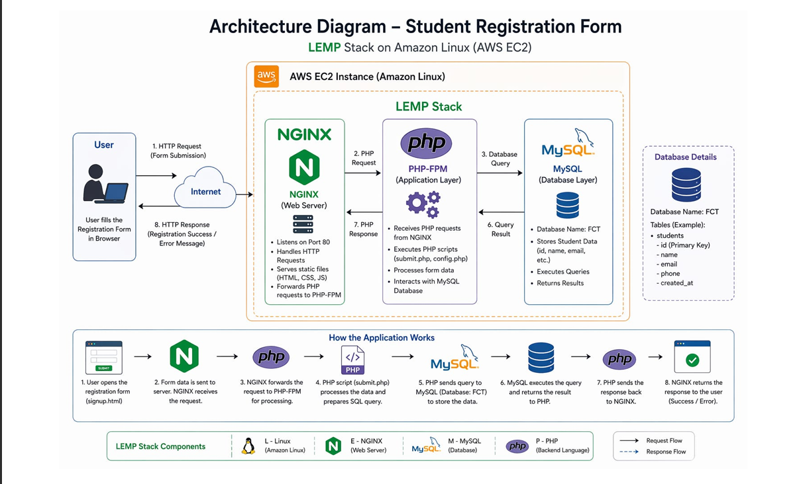
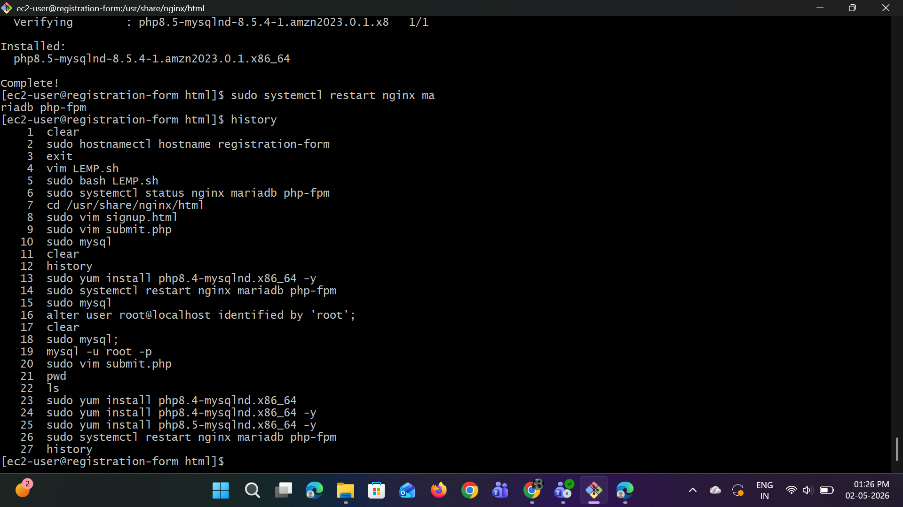
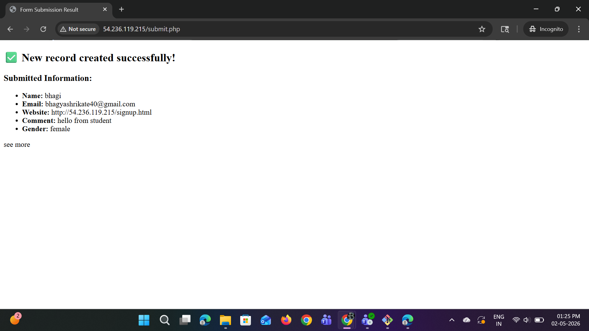

## Registration Form Deployment (Dynamic Website LEMP Stack)

# 1)Introduction:
  This is my first dynamic website called Student Registration Form.In this Website where users can enter their
  details like name, email, and other information.
  The website is built using:
  Frontend → HTML , CSS
  Backend → PHP
  Database → MySQL
  It is deployed on an Amazon Linux EC2 server using the LEMP stack (Linux, NGINX, MySQL, PHP). This setup
  helps the website to run online and store student data securely.
# 2) Architecture Diagram:
   
    
    
# 3)Deployment :

1:create EC2 instance
  

2:Install LEMP :
sudo yum update 

sudo yum install nginx php php-fpm

php-mysqlnd mariadb-server -y

3:Start Services

sudo systemctl start nginx

sudo systemctl enable nginx

sudo systemctl start php-fpm

sudo systemctl enable php-fpm

sudo systemctl start mariadb

sudo systemctl enable mariadb
  

4:check status

5:hit public ip we can see LEMP page
  

6:Setup Database
Login:

mysql -u root -p

Create database: CREATE DATABASE FCT;

Create table:

USE FCT;

CREATE TABLE students ( id INT AUTO_INCREMENT PRIMARY KEY, name VARCHAR(100),email VARCHAR(50));

7: Create files

signup.html - for ui

submit.php -for backend

8: Download connector

sudo yum install php8.5-mysqlnd.x86_64 -y

9: After all steps restart the system
  

10: Access website using public ip
open browser
 

11: Fill form and submit data
  

# 4) Summery
This project is a dynamic student registration form built using the LEMP stack. It shows how PHP and MySQL
work together to collect and store user data. The website handles user input, processes it on the server, and
saves it in the database. This is an important step in my journey towards DevOps, and cloud computing.